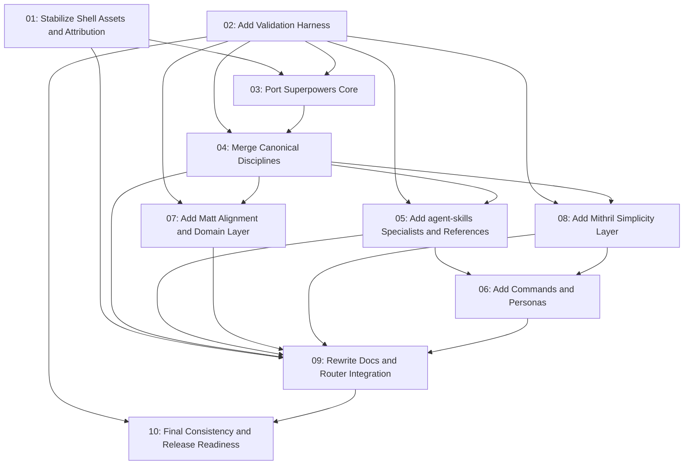

# Mithril Merge

## Overview

Implement the approved Mithril merge plan by turning the current rebranded plugin shell into a curated agent-engineering methodology. The redo is source-first: copy selected source skills, apply required Mithril renaming, commit that source-derived baseline, then perform the combined rewrite and synthesis later. The work ports the Superpowers runtime core, brings in overlapping discipline source material, adds selected agent-skills and Matt Pocock specialist coverage, adds a Mithril-native simplicity layer, and rewrites public docs and harness instruction files around a single Mithril router.

## Quick Links

- [Requirements](./requirements.md) - full requirements and acceptance criteria
- [Design](../../design/2026-06-24-mithril-merge/design.md) - approved solution shape and decisions
- [Action Required](./action-required.md) - manual steps needing human action
- [Manifest](./spec.json) - machine-readable orchestration contract
- [Implementation Log](./implementation-log.md) - append-only execution and review record

## Dependency Graph

## Waves

| Wave | Tasks | Description |
|------|-------|-------------|
| 1 | task-01, task-02 | Stabilize the shell and add validation foundations in parallel. |
| 2 | task-03 | Copy and rename the Superpowers execution core. |
| 3 | task-04 | Copy and rename overlapping discipline source material. |
| 4 | task-05, task-07, task-08 | Copy and rename specialist skill surfaces in parallel without router integration. |
| 5 | task-06 | Add command and persona orchestration after the skill surfaces exist. |
| 6 | task-09 | Rewrite docs and integrate routing once the complete skill set is present. |
| 7 | task-10 | Run final consistency, validation, packaging, and release-readiness checks. |

## Task Status

### Wave 1
- [ ] [task-01-stabilize-shell-assets-attribution](./tasks/task-01-stabilize-shell-assets-attribution.md) - Stabilize shell assets, attribution, and existing bootstrap ownership
- [ ] [task-02-add-validation-harness](./tasks/task-02-add-validation-harness.md) - Add validators, test scripts, and CI-ready verification commands

### Wave 2
- [ ] [task-03-port-superpowers-core](./tasks/task-03-port-superpowers-core.md) - Copy and rename the Superpowers core workflow skills

### Wave 3
- [ ] [task-04-merge-canonical-disciplines](./tasks/task-04-merge-canonical-disciplines.md) - Copy and rename TDD, debugging, review, skill-design, and implementation standards source material

### Wave 4
- [ ] [task-05-add-agent-specialists-references](./tasks/task-05-add-agent-specialists-references.md) - Copy and rename selected agent-skills specialists and references
- [ ] [task-07-add-matt-alignment-domain](./tasks/task-07-add-matt-alignment-domain.md) - Copy and rename selected Matt alignment, domain, issue, and architecture skills
- [ ] [task-08-add-simplicity-layer](./tasks/task-08-add-simplicity-layer.md) - Copy and rename Mithril Simplicity Layer skills and commands

### Wave 5
- [ ] [task-06-add-commands-personas](./tasks/task-06-add-commands-personas.md) - Add commands, personas, and orchestration boundaries

### Wave 6
- [ ] [task-09-rewrite-docs-router-integration](./tasks/task-09-rewrite-docs-router-integration.md) - Rewrite public docs, instruction files, and `using-mithril` routing

### Wave 7
- [ ] [task-10-final-consistency-release](./tasks/task-10-final-consistency-release.md) - Final validation, stale-name search, packaging, and release notes
